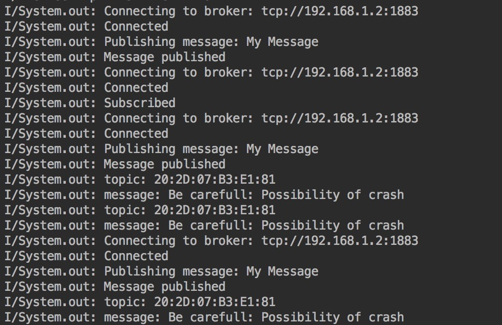
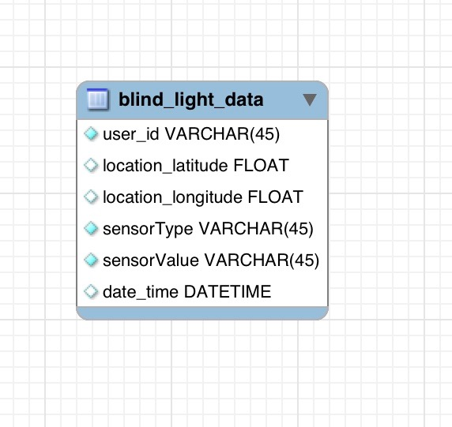
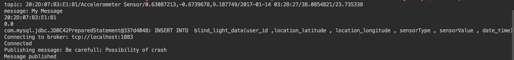
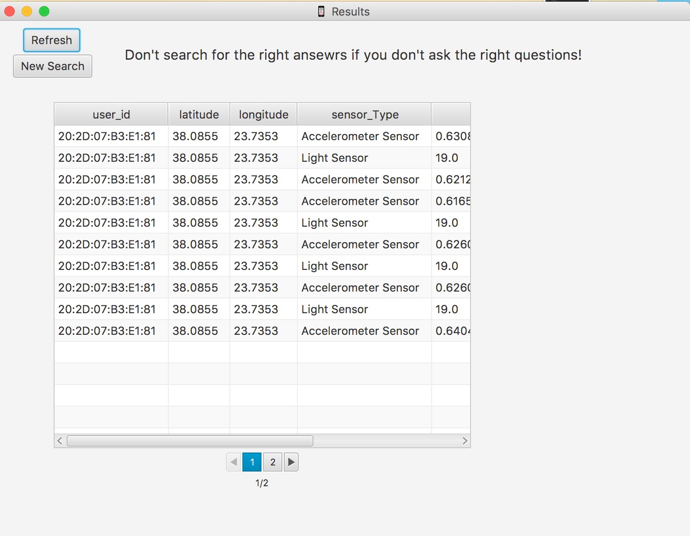
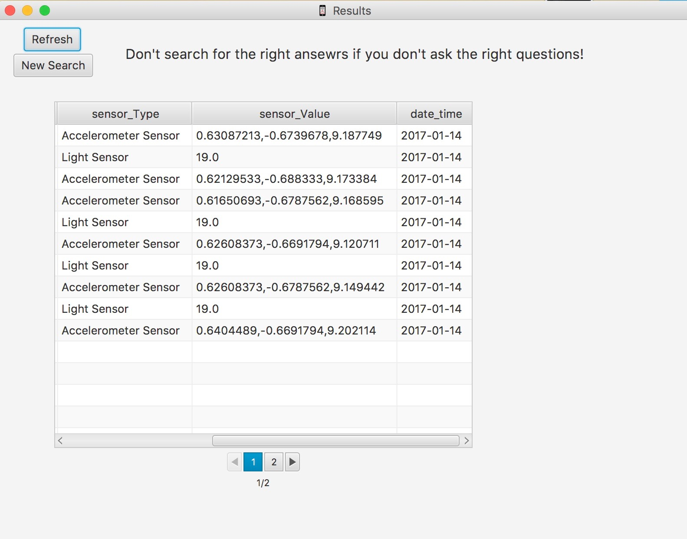
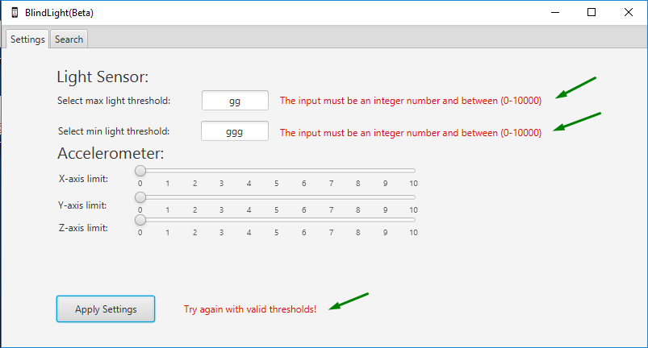
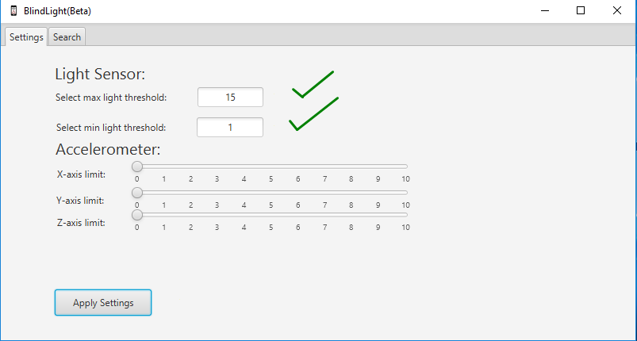
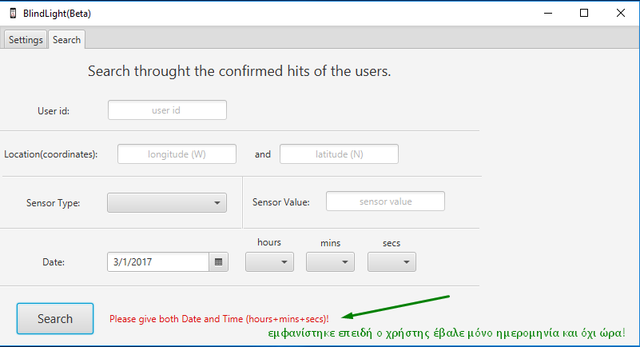

# projectK23b :sparkles: <h3>[BlindLight](https://github.com/taggelos/projectK23b) :mortar_board:

><b>Ά</b>γγελος Τουμάσης  ΑΜ 115201300177 <br>
><b>Μ</b>αρία Μαρίνη  ΑΜ  115201300094 <br>
><b>Λ</b>εωνίδας Ηλιόπουλος  ΑΜ  115201300047  <br>


###Android Application :robot:

Η Android εφαρμογή τρέχει είτε σε online mode είτε σε offline mode. Η εναλλαγή μεταξύ online και offline κατάστασης γίνεται αυτόμοτα (με την βοήθεια της κλάσης NetworkStateReciever).Υπάρχει switch στη Main Activity το οποίο είναι λειτουργικό μόνο οταν βρισκόμαστε στην Online λειτουργία , ώστε όποτε θέλήσει ο χρήστης να μπορεί να μπει στην Offline. Οι δυο συναρτήσεις που καθορίζουν τις διαφορετικές λειτουργίες που κάνει η εφαρμογή ανάλογα με το mode στο οποίο βρισκόμαστε είναι η NetworkAvailable() και NetworkUnAvailable().
 
Ενδεικτικός Κώδικας από το αρχείο MainActivity.java
  
  ```java
//-----------------Network state---------------

    @Override
    public void networkAvailable() {
        Context  context = getApplicationContext();
        CharSequence text = "Mode: ONLINE";
        Toast.makeText(context, text, Toast.LENGTH_SHORT).show();
        offline_mode = false;
        invalidateOptionsMenu();
        connectivity_Mode = (Switch) findViewById(R.id.connectivity);
        connectivity_Mode.setEnabled(true);
        connectivity_Mode.setChecked(true);
        if (locationManager.isProviderEnabled(LocationManager.GPS_PROVIDER)) {
            CharSequence text2 = "GPS : ENABLED";
            Toast.makeText(context, text2, Toast.LENGTH_SHORT).show();
        } else {
            buildAlertMessageNoGps();
        }

    }

    @Override
    public void networkUnavailable() {
        Context context = getApplicationContext();
        CharSequence text = "Mode: OFFLINE";
        Toast.makeText(context, text, Toast.LENGTH_SHORT).show();
        offline_mode =true;
        invalidateOptionsMenu(); //  we call this function to update options_menu
        connectivity_Mode = (Switch) findViewById(R.id.connectivity);
        connectivity_Mode.setChecked(false);
        connectivity_Mode.setEnabled(false);
    }


```

Χρειάζεται να σημειώσουμε τα ακόλουθα κάνοντας τον εξής διαχωρισμό:

ΟFFLINE λειτουργία :
        
Η εφαρμογή είναι λειτουργικά ίδια με αυτη που παραδώσαμε στο 1ο παραδοτέο (όπως και η δυνατότητα εναλλαγής στα ελληνικά, για όσους χρήστες έχουν τη συγκεκριμένη γλώσσα στο κινητό τους). Σε οτι αφορά την παραμετροποίηση των αισθητήρων είναι λειτουργικό. Ωστόσο προστέθηκε ένα νέο item που αφορά στις ρυθμίσεις που είναι απαραίτητες για την συνδεση με τον Mqtt Broker(ip,Port) για την Online λειτουργία. Βέβαια εδώ το κουμπτί δεν έχει καμία λειτουργικότητα οπότε και απενεργοποιείται.
          
        
ΟΝLINE λειτουργία :
        
Στην εφαρμογή τώρα το item για τις ρυθμίσεις που αφορουν στη συνδεση με τον  broker είναι λειτουργικό , ενώ εκείνο για την παραμετροποίηση στους Sensors δεν είναι. Κατα την επιλογή του item που αφορά τον Mqtt broker ανοίγεται στον χρήστη ένα dialog box ωστέ να θέσει το port(1883) και το ip (η ip του λάπτοπ οπου έχει εγκαταστηθεί ο broker) που είναι απαραίτητα για τη σύνδεση με αυτόν. 
        
Τα μηνύματα από και προς τον broker.
        
To κινητό-τερματικό κάνει publish κάθε φορά που εντοπιστεί μια αλλαγή στην / στις τιμές κάποιου από τους Sensors.Δηλαδή μέσα σε κάθε onSensorChange(). (Eνδεικτικό αρχείο : ProximityEventListener.java)
          
```java
 @Override
    public void onSensorChanged(SensorEvent event) {

        sensor_value = Float.toString(event.values[0]);
        proxText.setText("Οff");

        if(event.values[0] == 0){
            proxText.setText("Οn");
        }


        //---------------Calling Async Task Function---------------


        if (offline_mode == false) {

            Calendar c = Calendar.getInstance();
            SimpleDateFormat format = new SimpleDateFormat("yyyy-MM-dd HH:mm:ss");
            date = format.format(Calendar.getInstance().getTimeInMillis());

            //final String c = sensor_value;
            String topic = macAddress + "/" + getSensorName() + "/" + getSensorValue() + "/" + date + "/" + locationListener.getDevLatitude() + "/" + locationListener.getDevLongtitude();
            tt = new MyAsyncTask(topic, Port_Ip , context);
            tt.execute();

        }
        else {
            if ((event.values[0] == 0) && (CheckProx)) {
                proxText.setText("Οn");
                CharSequence text = "Βe careful!!";
                final Toast toast = Toast.makeText(context, text, Toast.LENGTH_SHORT);
                toast.show();
                Handler handler = new Handler();
                handler.postDelayed(new Runnable() {
                    @Override
                    public void run() {
                        toast.cancel();
                    }
                }, 1500);
                streamId = se.playNonStop(soundId);
                return;
            }
            se.stopSound(streamId);
        }
    }
```
        
        
Δημιουργείται λοιπόν επιτόπου κατάλληλο τόπικ το οποίο είναι ένα string που περιέχει τη macAddress του κινητού, τις τιμές και τον τύπο του αισθητηρα, την ώρα και ημερομηνία της μέτρησης καθώς και την τρέχουσα τοποθεσία του τερματικόυ. Κάνει publish ως ΜyclientidAndroid. Κάνουμε publish μέσω ενός AsyncTask με time 1sec. Ο εντοπισμός της MacAddress καθώς επίσης και της τρέχουσας ημερομηνίας και ώρας γίνεται με κατάλληλες συναρτήσεις. Σε ότι αφορά το Gps σημειωνουμε πως ζητείται απο τον χρήστη σε περίπτωση που το έχει ανενεργό να το ενεργοποιήσει ωστέ μέσω του MyLocationListener.java να εντοπίζεται συνεχως η τρέχουσα τοποθεσία του χρήστη.
        
Σημειώνουμε πως αφού το android τερματικό κάνει publish το 1ο μήνυμα του κάνει αμέσως subscribe με topic τη mac address. Έτσι κάθε κινητό θα ακούει σε ένα και μόνο topic μιας και η macAddress ειναι διαφορετική.
        
Ενδεικτικός Κώδικας. (Συνάρτηση doInBackground() του MyAsyncTask.java
        
```java
         @Override
       protected Void doInBackground(Void... params) {

        try {
                int time = 4000;
                // Sleeping for given time period
                Thread.sleep(time);
                if (offline_mode==false) {
                    publisher = new MqttPublisher();
                    publisher.main(topic, ip_port);
                    if(!broker_run_flag){
                        subscriber = new MqttSubscriber();
                        subscriber.main("20:2D:07:B3:E1:81" ,ip_port  , context);
                        broker_run_flag=true;
                    }

                }
                else {
                    return null;
                }

            } catch (InterruptedException e) {
                e.printStackTrace();
            } catch (Exception e) {
                e.printStackTrace();
            }


        return null;
    }
```
Σημείωση: Η boolean μεταβλητή broker_run_flag χρησιμοποιείται ώστε να ελεγχθεί το γεγονός οτι γίνεται 
μια φορά subscribe.

Συνολικά στο project του Android studio υπάρχουν 16 αρχεία , τα οποία οπως θα δείτε και εσείς έχουν τοποθετηθεί σε 4 διαφορετικά packages ανάλογα με τη λειτουργικότητα τους. (Αctivities , Services , Listeners , util )

Mια ενδεικτική εκτέλεση της android εφαρμογης όπως καταγράφεται απο τον run πεδίο στο android studio σε ONline mode είναι η ακόλουθη: (Επικοινωνία Pub-Sub)



 
###Java Application :coffee:
Σε ότι αφορά την Java Εφαρμογή.

Εδώ ορίζουμε μέσω του JavaFx τα καταλληλα thresholds που αφορουν στις τιμές που θα λάβουμε απο τους αισθητήρες των κινητών. Αυτά τα όρια θα καθορίσουν αν το εκάστοτε topic θα μπεί στη βάση μας. Αξίζει να σημειωθεί οτι η βάση μας mydb βρίσκεται μέσα στo java project και κάθε φορά που τρέχουμε το project απο την αρχή πρωτα καθαρίζουμε τη βάση μέσω ενός SQL ερωτήματος ωστέ να απαλαγούμε απο παλιές μετρήσεις , που δεν μας αφορούν.

Κατα την επιλογή Apply στο γραφικό κομμάτι javaFx κάνουμε μια φορά (ξανά ελέγχεται με μια boolean flag) subscribe με topic="#" port=1883 και ip=localhost ωστέ να λαμβάνουμε τα μηνύματα απο όλα τα κινητά που κάνουν publish.

Αφου ληφθεί το κάποιο μήνυμα , ελέγχουμε ένα ένα τα πεδία του topic και αν κρίνεται απαραίτητο βάσει τον thresholds μπαίνει στη βάση μας.


Η βάση μας περιέχει τα εξής πεδία:




Αν κάποια μέτρηση(καθώς και όλες οι λοιπές πληροφρίες που έχουν φτάσει σε αυτό το topic δηλαδή , macAddress , Sensor Type , DateTime , latitude , longtitude) μπεί τελικά στη βάση , τότε ταυτοχρονα διαχωρίχεται αν είναι πιθανή η επιβεβαιωμένη και στέλνετε στο / στα τερματικά αντίχτοιχο μηνυμα ειδοποίησης διαφορετικο σε κάθε περιπτωση πιθανής η επιβεβαιωμένης σύγκρουσης. Γίνεται δηλαδή publish απο τον server τώρα ποια με topic τη macAddress του/των εμπλεκόμενου/ων κινητού/ων. Το  port ξανά το 1883 και η ip->localhost.

Αξίζει να σημειωθεί πως με το φτάνει κάποιο topic στον server , δημιουργείται THREAD ανά topic , ωστέ ο server να είναι σε θέση παράλληλα να διαχειρίζεται πολλά topics δηλαδή μηνυματα.


Ενδεικτική εκτέλεση του server όπως καταγράφεται απο το πεδίο run του intelliJ.
Συγκεκριμένα βλέπουμε οτι λαμβάνει ένα topic το οποίο βάζει στη βάση και στέλνει μηνυμα ειδοποίησης στο κινητό που έκανε το publish.




Eπιπρόσθετα η βάση μας σε καποια χρονική στιγμή κατά την εκτέλεση του προγράμματος παρουσιάζεται στην ακόλουθη εικόνα.






Το γραφικό περιβάλλον της Java εφαρμογής βασίστηκε σε Java FX:


- Η πρώτη οθόνη (Tab) είναι η Settings στην οποία ρυθμίζουμε τις τιμές των κατωφλιών των αισθητήρων με αντίστοιχο τρόπο με αυτόν που είχε υλοποιηθεί στις ρυθμίσεις της Android εφαρμογής. Όταν ο χρήστης πατάει το κουμπί Apply Settings πριν δοθούν οι ρυθμίσεις ελέγχονται τυχόν κακόβουλες εισαγωγές στα thresholds του Light Sensor. Σε περίπτωση που εντοπιστούν, τα Settings δεν γίνονται Apply και ζητείται εκ νέου ρύθμιση μέχρις ότου ανιχνευτεί η απαιτούμενη.<br>


- Η δεύτερη οθόνη (Tab) είναι η καρτέλα-οθόνη Search στα πλαίσια της οποίας γίνεται η πολυκριτηριακή αναζήτηση με βάση οποιοδήποτε πεδίο της βάσης όπως ακριβώς αυτή ζητήθηκε. Ακόμα ελέγχεται το αν ο χρήστης δίνει την απαραίτητη μορφή της ημερομηνίας η οποία πρέπει να είναι πλήρης με μορφή ημερομηνίας και ώρας (ώρα, λεπτά, δευτερόλεπτα). Τα αποτελέσματα της αναζήτησης εμφανίζονται όταν ο χρήστης πατά το κουμπί Search. Τότε μεταβαίνει σε νέα οθόνη Results στην οποία μαζί με τα αποτελέσματα δίνεται η δυνατότητα για εκ νέου φόρτωση των νέων εισαγωγών που έχουν γίνει στην βάση με τις επιβεβαιωμένες εισαγωγές με βάση τα κριτήρια που δόθηκαν μέσω του κουμπιού Refresh όπως και η επιστροφή στην κύρια εφαρμογή με σκοπό την αναζήτηση με νέα κριτήρια μέσω του κουμπιού New Search. Τέλος, αναφέρουμε ότι η οθόνη Results υποστηρίζει την σελιδοποίηση η οποία ζητήθηκε κατά την εκφώνηση της εργασίας.
 <br>
Όλες οι συναρτήσεις οι οποίες βρίσκονται "πίσω" από τα γραφικά στοιχεία (Apply, Search, New Search) υλοποιούνται εντός του Controller.java. Οι λειτουργίες τους είναι διακριτές και σαφείς. Όπου κρίθηκε αναγκαίο έχει δημιουργηθεί ο κατάλληλος σχολιασμός εντός του πηγαίου κώδικα με σκοπό να διευκολύνει κατά την διαδικασία της διόρθωσης.
Τέλος, μεριμνήσαμε έτσι ώστε η εφαρμογή να είναι καλαίσθητη μέσω διαφόρων μορφοποιήσεων, αφού ως ομάδα  θεωρούμε ότι το Project με το οποίο έχουμε καταπιαστεί όλους αυτούς τους μήνες έχει ως σκοπό όχι μόνο να οξύνει τις όποιες προγραμματιστικές ικανότητές μας αλλά και το μεράκι μας, την προγραμματιστική αισθητική και την ανάγκη μας να πηγαίνουμε ένα βήμα πιο κάτω.

Σημαντική Επισήμανση: 
Mέσα στο αρχείο Settings.fxml έχουν υλοποιηθεί τα παράθυρα Settings και Search!
Μέσα στο αρχείο Search.fxml έχει υλοποιηθεί το παράθυρο Results!


###Bonus :camera:

Όσον αφορά την προαιρετική επέκταση με Google Vision API υλοποιήθηκε ότι ζητούνταν, ως εξής:
  1. Έγινε χρήση ενός Activity (αντί για Service όπως σχεδιάστηκε στην αρχή), με layout παρόμοιο με της Main Activity (χωρίς ενδείξεις και το bar που αναγράφει "Beware of your Surroundings") για να δείξουμε ότι λαμβάνονται οι τιμές και εξάγεται κάποιο αποτέλεσμα εκείνη τη στιγμή.
  2. Το αποτέλεσμα που λαμβάνει ο χρήστης είναι ακουστικό πέρα από το παραπάνω οπτικό, με χρήση TextToSpeech που πρέπει να έχει ενεργοποιηθεί στο κινητό μας. Ακούγεται μήνυμα "Be Careful!" ακολουθούμενο από μια λέξη που είναι το αποτέλεσμα που εξάγεται από τη λήψη φωτογραφίας μέσω της υπηρεσίας της Google με το αντίστοιχο API key που δημιουργήσαμε για τη συγκεκριμένη εργασία. Η λέξη είναι η περιγραφή (description) του πρώτου αποτελέσματος που λαμβάνουμε, το οποίο είναι και το πιο πιθανό να αναπαριστά το αντικείμενο της φωτογραφίας.
  3. Στην περίπτωση σύγκρουσης ενεργοποιείται κατευθείαν η κάμερα και ο χρήστης πρέπει μόνο να πατήσει κλικ (προειδοποιείται για αυτό μέσω Toast που αναγράφει "PRESS CLICK ON CAMERA") και έπειτα ΟΚ στο Result που έχει. Δεν χρησιμοποιήθηκε υλοποίηση που είχαμε με SurfaceView που θα έκρυβε τα παραπάνω panel μιας και δεν θεωρείται καλή πρακτική να παρακάμψουμε τον τρόπο με τον οποίο είναι υλοποιημένη η κάμερα στο android, δηλαδή με τα συγκεκριμένα panel που εμφανίζονται.
  4. Αφού πραγματοποιηθούν επιτυχώς τα παραπάνω επιστρέφουμε στην MainActivity μας, όπου υπάρχει Switch που κάνει την ενεργοποίηση/απενεργοποίηση όπως ζητείται.

Γενική Σημείωση: O TTS μηχανισμός επηρεάζεται απο το AsyncTask που έχει υλοποιήθεί σε κάθε sensor στην Android Εφαρμογή. Σε ότι αφορά την υλοποίηση μας για να λειτουργεί σωστά και να ακούσουμε το ηχητικό αποτέλεσμα πρέπει να μην λειτουργούν ταυτόχρονα τα AsyncTask αλλά μόνο εξ αυτών.Λόγω χρόνου δεν έχουν γίνει δοκιμές για τη σωστή λειτουργια και με τους 3. Παρόλο αυτά, επιλέξαμε στο παραδοτέο να σχολιάσουμε τις γραμμες 124-143 στο AccelerometerEventListener  και τις 80-97 στο ProximityEventListener, ώστε να ναι πλήρως λειτουργικό. Αν αποσχολιαστούν υλοποιείται οτιδήποτε άλλο απο την εκφώνηση, μάζι με όλα όσα αναφέρθηκαν.Tα παραπάνω θα παρουσιαστούν αναλυτικά και κατά την προγραμματισμένη συνέντευξη.Επίσης, δηιουργήσαμε class Diagram αλλά επειδή δεν προλάβαμε να το ολοκληρώσουμε λόγω των πολλών αρχείων μας και του χρόνου που είχαμε, έχουμε μόνο ενα ενδεικτικό screenshot στον φάκελο images.

Ευχαριστούμε

Καλή Διόρθωση :heart:
