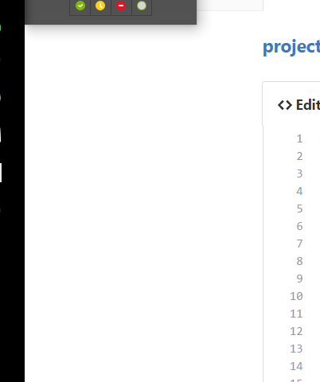

# projectK23b :sparkles: <h3>[BlindLight](https://github.com/taggelos/projectK23b) :mortar_board:

>VALTE KAPOIOS TA AM MAS EDW  
>sxoliakia kai etsi



```java
ENDEIKTIKOS KWDIKAS AN THELETE NA DEIKSETE KOMMATI SAS
function fancyAlert(arg) {
  if(arg) {
    $.facebox({div:'#foo'})
  }
}
```
###Android Application :robot:

Σε ότι αφορά την Android εφαρμογή έχουν υλοποιηθεί τα εξής.

  -Η εφαρμοφή τρέχει είτε σε online mode είτε σε offline mode. Η εναλλαγή μεταξύ online και offline κατάστασης γίνεται αυτόμοτα (με την βοήθεια της κλάσσης NetworkStateReciever).Υπάρχει , βέβαία ενα switch στη Main Activity το οποίο είναι λειτουργικό μόνο οταν βρισκόμαστε στην Online λειτουργια , ωστε όποτε θέλουμε να μπουμε στην Offline. Οι δυο συναρτήσεις που καθορίζουν τις διαφορετικές λειτουργίες που κάνει η εφαρμογή ανάλογα με το mode στο οποίο βρισκόμαστε είναι η NetworkAvailable() και NetworkUnAvailable().
  Ενδεικτικός Κώδικας απο το αρχείο MainActivity.java
  
  ```java
//-----------------Network state---------------

    @Override
    public void networkAvailable() {
        Context  context = getApplicationContext();
        CharSequence text = "Mode: ONLINE";
        Toast.makeText(context, text, Toast.LENGTH_SHORT).show();
        offline_mode = false;
        invalidateOptionsMenu();
        connectivity_Mode = (Switch) findViewById(R.id.connectivity);
        connectivity_Mode.setEnabled(true);
        connectivity_Mode.setChecked(true);
        if (locationManager.isProviderEnabled(LocationManager.GPS_PROVIDER)) {
            CharSequence text2 = "GPS : ENABLED";
            Toast.makeText(context, text2, Toast.LENGTH_SHORT).show();
        } else {
            buildAlertMessageNoGps();
        }

    }

    @Override
    public void networkUnavailable() {
        Context context = getApplicationContext();
        CharSequence text = "Mode: OFFLINE";
        Toast.makeText(context, text, Toast.LENGTH_SHORT).show();
        offline_mode =true;
        invalidateOptionsMenu(); //  we call this function to update options_menu
        connectivity_Mode = (Switch) findViewById(R.id.connectivity);
        connectivity_Mode.setChecked(false);
        connectivity_Mode.setEnabled(false);
    }


```

Χρειάζεται να σημειώσουμε τα ακόλουθα κάνοντας τον εξής διαχωρισμό.

        ΟFFLINE λειτουργια :
        
          Η εφαρμογή είναι λειτουργικά ίδια με αυτη που παραδώσαμε στο 1ο παραδοτέο.Στο menu bar το item για τις ρυθμίσεις      σε οτι αφορά την παραμετροποίηση των αισθητήρων είναι λειτουργικό. Ωστόσο προστεθηκε ένα νέο item που αφορά στις ρυθμίσεις που είναι απαραίτητες για την συνδεση με τον Mqtt Broker(ip,Port) για την Online λειτουργία. Βεβαια εδώ το κουμπτί δεν έχει καμια λειτουργικότητα.
          
        
        
        ΟΝLINE λειτουργια :
        
        Στην εφαρμογή τώρα το item για τις ρυθμίσεις που αφορουν στη συνδεση με τον  broker είναι λειτουργικό , ενώ εκείνο για την παραμετροποίηση στους σένσορες δεν είναι. Κατα την επιλογή του item που αφορά τον Mqtt broker ανοίγεται στον χρήστη ένα dialog box ωστέ να θέσει το port(1883) και το ip(η ip του λάπτοπ οπου έχει εγκαταστηθεί ο broker) που είναι απαραίτητα για τη σύνδεση με αυτόν. 
        
        Τα μηνύματα απο και προς τον broker.
        
        To κινητό-τερματικό κάνει publish κάθε φορά που εντοπιστεί μια αλλαγή στην / στις τιμές κάποιου απο τους σένσορες.Δηλαδή μέσα σε κάθε onSensorChange(). (Eνδεικτικό αρχείο : ProximityEventListener.java)
          
```java
 @Override
    public void onSensorChanged(SensorEvent event) {

        sensor_value = Float.toString(event.values[0]);
        proxText.setText("Οff");

        if(event.values[0] == 0){
            proxText.setText("Οn");
        }


        //---------------Calling Async Task Function---------------


        if (offline_mode == false) {

            Calendar c = Calendar.getInstance();
            int seconds = c.get(Calendar.SECOND);
            SimpleDateFormat format = new SimpleDateFormat("yyyy-MM-dd HH:mm:ss");
            date = format.format(Calendar.getInstance().getTimeInMillis());

            //final String c = sensor_value;
            String topic = macAddress + "/" + getSensorName() + "/" + getSensorValue() + "/" + date + "/" + locationListener.getDevLatitude() + "/" + locationListener.getDevLongtitude();
            tt = new MyAsyncTask(topic, Port_Ip , context);
            tt.execute();

        }
        else {
            if ((event.values[0] == 0) && (CheckProx)) {
                proxText.setText("Οn");
                CharSequence text = "Βe careful!!";
                final Toast toast = Toast.makeText(context, text, Toast.LENGTH_SHORT);
                toast.show();
                Handler handler = new Handler();
                handler.postDelayed(new Runnable() {
                    @Override
                    public void run() {
                        toast.cancel();
                    }
                }, 1500);
                streamId = se.playNonStop(soundId);
                return;
            }
            se.stopSound(streamId);
        }
    }
```
        
        
        
        
        
        
        Δημιουργείται λοιπον επιτόπου κατάλληλο τόπικ το οποίο είναι ένα string που περιέχει τη mavAddress του κιητόυ, τις τιμές και τον τυπο του αισθητηρα, την ωρα και ημερομηνία της μέτρησης καθως και την τρέχουσα τοποθεσία του τερματικόυ. Κάνει publish ως ΜyclientidAndroid. Κάνουμε publish μέσω ενός AsyncTask με time 1sec. Ο εντοπισμός της MacAddress καθώς επίσης και της τρέχουσας ημερομηνίας και ώρας γίνεται με κατάλληλες συναρτήσεις. Σε ότι αφορά το Gps σημειωνουμε πως ζητείται απο τον χρήστη σε περίπτωση που το έχει ανενεργό να το ενεργοποιήσει ωστέ μέσω του MyLocationListener.java να αντοπίζεται συνεχως η τρέχουσα τοποθεσία του χρήστη.
        Σημειώνουμε πως αφού το android τερματικό κάνει publish το 1ο μηνυμα του κάνει αμέσως subscribe με topic τη mac address. Eτσι κάθε κινητό θα ακουει σε ένα και μόνο topic μιας και η macAddress ειναι διαφορετική.
        
        Ενδεικτικός Κωδικας. (Συνάρτηση doInBackground() του MyAsyncTask.java
        
```java
         @Override
       protected Void doInBackground(Void... params) {

        try {
                int time = 4000;
                // Sleeping for given time period
                Thread.sleep(time);
                if (offline_mode==false) {
                    publisher = new MqttPublisher();
                    publisher.main(topic, ip_port);
                    if(!broker_run_flag){
                        subscriber = new MqttSubscriber();
                        subscriber.main("20:2D:07:B3:E1:81" ,ip_port  , context);
                        broker_run_flag=true;
                    }

                }
                else {
                    return null;
                }

            } catch (InterruptedException e) {
                e.printStackTrace();
            } catch (Exception e) {
                e.printStackTrace();
            }


        return null;
    }
```
Σημείωση: Η boolean μεταβλητη broker_run_flag χρησιμοποιείται ωστε να ελεγχθεί το γεγονός οτι γίνεται 
μια φορα subscribe.

Συνολικά στο project του Android studio υπάρχουν 20 αρχεία , τα οποία οπως θα δείτε και εσεις έχουν τοποθετηθεί σε 4 διαφορετικά packages ανάλογα με τη λειτουργικότητα τους. (Αctivities , Services , Listeners , util )

Mια ενδεικτική εκτέλεση της android εφαρμογης όπως καταγράφεται απο τον run πεδίο στο android studio σε ONline mode είναι η ακόλουθη: (Επικοινωνία Pub-Sub)


 
###Java Application :coffee:
Σε ότι αφορά την Java Εφαρμογή.

Εδώ ορίζουμε μέσω του JavaFx τα καταλληλα thtresholds που αφορουν στις τιμές που θα λάβουμε απο τους αισθητήρες των κινητών. Αυτά τα όρια θα καθορίσουν αν το εκαστοτε topic θα μπεί στη βάση μας. Αξίζει να σημειωθεί οτι η βάση μας mybd βρίσκεται μέσα στo java project και κάθε φορά που τρεχουμε το project απο την αρχή πρωτα καθαρίζουμε τη βάση μέσω ενός SQL ερωτήματος ωστέ να απαλαγούμε απο παλιές μετρησεις , που δεν μας αφορούν.

Κατα την επιλογή Apply στο γαρφικό κομματι javaFx κάνουμε μια φορα (ξανά ελέγχεται με μια boolean flag) subscribe με topic="#" port=1883 και ip=localhost ωστέ να λαμβάνουμε τα μηνύματα απο όλα τα κινητά που κάνουν publish.

Αφου ληφθεί το κάποιο μηνυμα , ελέγχουμε ένα ένα τα πεδία του topic και αν κρίνεται απαραίτητο βάσει τον thresholds μπαίνει στη βάση μας.


Η βάση μας περιέχει τα εξής πεδία:


Το γραφικό περιβάλλον της Java εφαρμογής βασίστηκε σε Java FX:


- Η πρώτη οθόνη (Tab) είναι η Settings στην οποία ρυθμίζουμε τις τιμές των κατωφλιών των αισθητήρων με αντίστοιχο τρόπο με αυτόν που είχε υλοποιηθεί στις ρυθμίσεις της Android εφαρμογής. Όταν ο χρήστης πατάει το κουμπί Apply Settings πριν δοθούν οι ρυθμίσεις ελέγχονται τυχόν κακόβουλες εισαγωγές στα thresholds του Light Sensor. Σε περίπτωση που εντοπιστούν, τα Settings δεν γίνονται Apply και ζητείται εκ νέου ρύθμιση μέχρις ότου ανιχνευτεί η απαιτούμενη.


- Η δεύτερη οθόνη (Tab) είναι η καρτέλα-οθόνη Search στα πλαίσια της οποίας γίνεται η πολυκριτηριακή αναζήτηση με βάση οποιοδήποτε πεδίο της βάσης όπως ακριβώς αυτή ζητήθηκε. Ακόμα ελέγχεται το αν ο χρήστης δίνει την απαραίτητη μορφή της ημερομηνίας η οποία πρέπει να είναι πλήρης με μορφή ημερομηνίας και ώρας (ώρα, λεπτά, δευτερόλεπτα). Τα αποτελέσματα της αναζήτησης εμφανίζονται όταν ο χρήστης πατά το κουμπί Search. Τότε μεταβαίνει σε νέα οθόνη Results στην οποία μαζί με τα αποτελέσματα δίνεται η δυνατότητα για εκ νέου φόρτωση των νέων εισαγωγών που έχουν γίνει στην βάση με τις επιβεβαιωμένες εισαγωγές με βάση τα κριτήρια που δόθηκαν μέσω του κουμπιού Refresh όπως και η επιστροφή στην κύρια εφαρμογή με σκοπό την αναζήτηση με νέα κριτήρια μέσω του κουμπιού New Search. Τέλος, αναφέρουμε ότι η οθόνη Results υποστηρίζει την σελιδοποίηση η οποία ζητήθηκε κατά την εκφώνηση της εργασίας.

Όλες οι συναρτήσεις οι οποίες βρίσκονται "πίσω" από τα γραφικά στοιχεία (Apply, Search, New Search) υλοποιούνται εντός του Controller.java. Οι λειτουργίες τους είναι διακριτές και σαφείς. Όπου κρίθηκε αναγκαίο έχει δημιουργηθεί ο κατάλληλος σχολιασμός εντός του πηγαίου κώδικα με σκοπό να διευκολύνει κατά την διαδικασία της διόρθωσης.
Τέλος, μεριμνήσαμε έτσι ώστε η εφαρμογή να είναι καλαίσθητη μέσω διαφόρων μορφοποιήσεων, αφού ως ομάδα  θεωρούμε ότι το Project με το οποίο έχουμε καταπιαστεί όλους αυτούς τους μήνες έχει ως σκοπό όχι μόνο να οξύνει τις όποιες προγραμματιστικές ικανότητές μας αλλά και το μεράκι μας, την προγραμματιστική αισθητική και την ανάγκη μας να πηγαίνουμε ένα βήμα πιο κάτω.

Σημαντική Επισήμανση: 
Mέσα στο αρχείο Settings.fxml έχουν υλοποιηθεί τα παράθυρα Settings και Search!
Μέσα στο αρχείο Search.fxml έχει υλοποιηθεί το παράθυρο Results!


###Bonus :camera:

Όσον αφορά την προαιρετική επέκταση με Google Vision API υλοποιήθηκε ότι ζητούνταν, ως εξής:
  1. Έγινε χρήση ενός Activity (αντί για Service όπως σχεδιάστηκε στην αρχή), με layout παρόμοιο με της Main Activity (χωρίς ενδείξεις και το bar που αναγράφει "Beware of your Surroundings") για να δείξουμε ότι λαμβάνονται οι τιμές και εξάγεται κάποιο αποτέλεσμα εκείνη τη στιγμή.
  2. Το αποτέλεσμα που λαμβάνει ο χρήστης είναι ακουστικό πέρα από το παραπάνω οπτικό, με χρήση TextToSpeech που πρέπει να έχει ενεργοποιηθεί στο κινητό μας. Ακούγεται μήνυμα "Be Careful!" ακολουθούμενο από μια λέξη που είναι το αποτέλεσμα που εξάγεται από τη λήψη φωτογραφίας μέσω της υπηρεσίας της Google με το αντίστοιχο API key που δημιουργήσαμε για τη συγκεκριμένη εργασία. Η λέξη είναι η περιγραφή (description) του πρώτου αποτελέσματος που λαμβάνουμε, το οποίο είναι και το πιο πιθανό να αναπαριστά το αντικείμενο της φωτογραφίας.
  3. Στην περίπτωση σύγκρουσης ενεργοποιείται κατευθείαν η κάμερα και ο χρήστης πρέπει μόνο να πατήσει κλικ (προειδοποιείται για αυτό μέσω Toast που αναγράφει "PRESS CLICK ON CAMERA") και έπειτα ΟΚ στο Result που έχει. Δεν χρησιμοποιήθηκε υλοποίηση που είχαμε με SurfaceView που θα έκρυβε τα παραπάνω panel μιας και δεν θεωρείται καλή πρακτική να παρακάμψουμε τον τρόπο με τον οποίο είναι υλοποιημένη η κάμερα στο android, δηλαδή με τα συγκεκριμένα panel που εμφανίζονται.
  4. Αφού πραγματοποιηθούν επιτυχώς τα παραπάνω επιστρέφουμε στην MainActivity μας, όπου υπάρχει Switch που κάνει την ενεργοποίηση/απενεργοποίηση όπως ζητείται.
