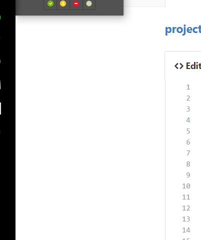
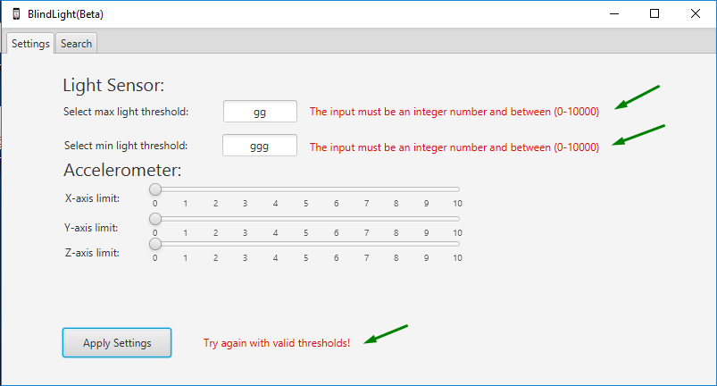
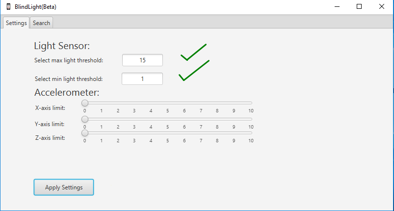
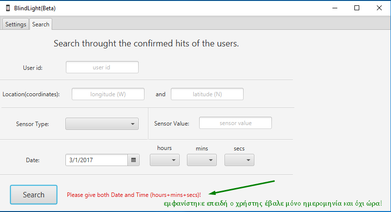

# projectK23b :sparkles: <h3>[BlindLight](https://github.com/taggelos/projectK23b) :mortar_board:

>VALTE KAPOIOS TA AM MAS EDW  
>sxoliakia kai etsi



```java
ENDEIKTIKOS KWDIKAS AN THELETE NA DEIKSETE KWMMATI SAS
function fancyAlert(arg) {
  if(arg) {
    $.facebox({div:'#foo'})
  }
}
```
###Android Application :robot:


###Java Application :coffee:
Το γραφικό περιβάλλον της Java εφαρμογής βασίστηκε σε Java FX:
- Η πρώτη οθόνη (Tab) είναι τα Settings στην οποία ρυθμίζουμε τις τιμές των κατωφλιών των αισθητήρων με αντίστοιχο τρόπο με αυτό που είχε υλοποιηθεί στις ρυθμίσεις της Android εφαρμογής. Όταν ο χρήστης πατάει το κουμπί Apply Settings πριν δωθούν οι ρυθμίσεις ρυθμίσεις ελέγχονται τυχόν κακόβουλες εισαγωγές στα thresholds του Light Sensor. Σε περίπτωση που εντοπιστούς τα Settings δεν γίνονται Apply και ζητήται εκ νέου ρύθμισει μέχρις ότου ανιχνευτεί η απαιτούμενη.


- Η δεύτερη οθόνη (Tab) είναι η καρτέρα-οθόνη Search στα πλαίσια της οποίας γίνεται η πολυκριτηριακή αναζήτηση με βάση οποιοδήποτε πεδίο της βάσης όπως ακριβώς αυτή ζητήθηκε. Ακόμα ελέγχεται το αν ο χρήστης δίνει την απαραίτητη μορφή της ημερομηνίας η οποία πρέπει να είναι πλήρης με μορφή ημερομηνίας και ώρας (ώρα, λεπτά, δευτερόλεπτα). Τα αποτελέσματα της αναζήτησης εμφανίζονται όταν ο χρήστης πατά το κουμπί Search. Τότε μεταβαίνει σε νέα οθόνη Results στην οποία μαζί με τα αποτελέσματα δίνεται η δυνατότητα για εκ νέου φόρτωση των νέων εισαγωγών που έχουν γίνει στην βάση με βάση τα κριτήρια που δόθηκαν μέσω του κουμπιού Refresh όπως και η επιστροφή στην κύρια εφαρμογή με σκοπό την αναζήτηση με νέα κριτήρια. Τέλος, αναφέρουμε ότι η oθόνη Results υποστηρίζει την σελιδοποίηση η οποία ζητήθηκε κατά την εμφώνηση.

Όλες οι συναρτήσεις οι οποίες βρίσκονται "πίσω" από τα γραφικά στοιχεία (Apply, Search, New Search) υλοιποιούνται εντός του Controller.java. Οι λειτουργίες τους είναι διακριτές και σαφής. Όπου κρίθηκε αναγκαίο έχει δημιουργηθεί ο κατάλληλος σχολιασμός εντός του πηγαίνου κώδικα με σκοπό να κατευθήνει.
Τέλος, μεριμνήσαμε έτσι ώστε η εφαρμογή να είναι καλαίσθητη μέσω διάφορων μορφοποιήσεων, αφού ως ομάδα  θεωρούμε ότι το Project με το οποίο έχουν καταπιαστεί όλους αυτούς τους μήνες έχει ως σκοπο όχι μόνο να οξύνει τις όποιες προγραμματιστηκές ικανότητες μας αλλά το μεράκι μας, την προγραμματιστηκή αισθητική και την ανάγκη μας να πηγαίνουμε ένα βήμα πιο κάτω.


###Bonus :camera:

Όσον αφορά την προαιρετική επέκταση με Google Vision API υλοποιήθηκε ότι ζητούνταν, ως εξής:
  1. Έγινε χρήση ενός Activity (αντι για Service οπως σχεδιάστηκε στην αρχή), με layout παρόμοιο με της Main Activity (χωρίς ενδείξεις και το bar που αναγράφει "Beware of your Surroundings") για να δείξουμε ότι λαμβάνονται οι τιμές και εξάγεται κάποιο αποτέλεσμα εκείνη τη στιγμή.
  2. Το αποτέλεσμα που λαμβάνει ο χρήστης είναι ακουστικό πέρα απο το παραπάνω οπτικό, με χρήση TextToSpeech που πρέπει να έχει ενεργοποιηθεί στο κινητό μας. Ακούγεται μύνημα "Be Careful!" ακολουθούμενο απο μια λέξη που είναι το αποτέλεσμα που εξάγεται από τη λήψη φωτογραφίας μέσω της υπηρεσίας της Google με το αντίστοιχο API key που δημιουργήσαμε για τη συγκεκριμένη εργασία. Η λέξη είναι η περιγραφή (description) του πρώτου αποτελέσματος που λαμβάνουμε, το οποίο είναι και το πιο πιθανό να αναπαριστά το αντικέιμενο της φωτογραφίας.
  3. Στην περίπτωση σύγκρουσης ενεργοποιείται κατευθείαν η κάμερα και ο χρήστης πρέπει μόνο να πατήσει κλικ (προειδοποιείται για αυτό μέσω Toast που αναγράφει "PRESS CLICK ON CAMERA") και έπειτα ΟΚ στο Result που έχει. Δεν χρησιμοποιήθηκε υλοποιήση που είχαμε με SurfaceView που θα έκρυβε τα παραπάνω panel μιας και δεν θεωρείται καλή πρακτική να παρακάμψουμε τον τρόπο με τον οποίο είναι υλοποιημένη η καμερα στο android, δηλαδή με τα συγκεκριμένα panel που εμφανίζονται.
  4. Αφού πραγματοποιηθούν επιτυχώς τα παραπάνω επιστρέφουμε στην MainActivity μας, όπου υπάρχει Switch που κάνει την ενεργοποίηση/απενεργοποίηση όπως ζητείται 
